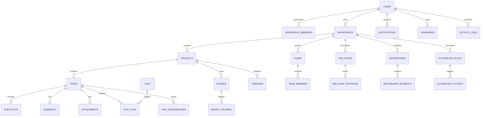

# TaskFlow Relational ERD Architecture (`docs/DB-erd/README.md`)

Cơ sở dữ liệu của **TaskFlow** được xây dựng trên **PostgreSQL** (Neon Serverless Cloud / Local PostgreSQL), tuân thủ nghiêm ngặt chuẩn chuẩn hóa relational schema và quản lý qua **34 scripts Flyway Versioned Migrations**.

---

## 1. High-Level Relational Schema Diagram (Sơ Đồ ERD Mermaid)

---

## 2. List of 34 Relational Database Tables (Danh Sách 34 Bảng CSDL)

1. `users`: Thông tin tài khoản người dùng, email, mật khẩu BCrypt, vai trò hệ thống.
2. `user_settings`: Cài đặt cá nhân, chủ đề theme giao diện, ngôn ngữ hiển thị (vi/en).
3. `auth_tokens`: Lưu vết Token JWT refresh, danh sách token thu hồi (blacklist).
4. `roles`: Vai trò quyền hạn hệ thống (`ROLE_ADMIN`, `ROLE_MANAGER`, `ROLE_USER`).
5. `permissions`: Danh mục các quyền thao tác chi tiết trong hệ thống.
6. `role_permissions`: Bảng trung gian nối giữa vai trò và danh mục quyền.
7. `workspaces`: Không gian làm việc đa người dùng (Multi-tenant container).
8. `workspace_members`: Bảng trung gian thành viên gia nhập Workspace kèm vai trò (`OWNER`, `ADMIN`, `MEMBER`).
9. `workspace_invitations`: Lời mời tham gia Workspace qua Token/Email.
10. `projects`: Dự án chứa danh sách công việc trong Workspace.
11. `tasks`: Thực thể công việc cốt lõi (Tiêu đề, mô tả, trạng thái, độ ưu tiên, ngày hết hạn).
12. `checklists`: Các công việc phụ (Subtask items) bên trong Task.
13. `comments`: Thảo luận, trao đổi tin nhắn trong từng Task.
14. `attachments`: Metadata tệp đính kèm (file name, URL, size, content type).
15. `tags`: Thẻ phân loại nhãn màu sắc.
16. `task_tags`: Bảng trung gian nối Task và Tag.
17. `boards`: Bảng Kanban trong dự án.
18. `board_columns`: Các cột trạng thái Kanban động trong Board.
19. `timelines`: Cấu hình sơ đồ Gantt tiến độ.
20. `task_dependencies`: Quan hệ phụ thuộc giữa các Task (`BLOCKS`, `BLOCKED_BY`, `DUPLICATES`, `RELATES_TO`).
21. `teams`: Đội nhóm làm việc trong Workspace.
22. `team_members`: Thành viên thuộc các đội nhóm.
23. `team_projects`: Dự án thuộc quyền quản lý của đội nhóm.
24. `wiki_pages`: Bài viết kho tri thức tài liệu dự án.
25. `wiki_page_revisions`: Lịch sử lưu vết chỉnh sửa các phiên bản trang Wiki.
26. `whiteboards`: Bảng vẽ tư duy phác thảo tương tác.
27. `whiteboard_elements`: Tọa độ và thuộc tính hình khối trên Whiteboard.
28. `saved_search_filters`: Bộ lọc tìm kiếm được người dùng lưu lại.
29. `search_index_entries`: Chỉ mục tìm kiếm nội dung toàn cục.
30. `automation_rules`: Các quy tắc tự động hóa (Trigger -> Action).
31. `automation_actions`: Các hành động tự động được thực thi theo quy tắc.
32. `automation_logs`: Lịch sử vết ghi nhận thực thi tự động hóa.
33. `reminders`: Thông báo nhắc nhở tự động theo mốc thời gian.
34. `calendar_events`: Sự kiện lịch làm việc và time-blocking.
