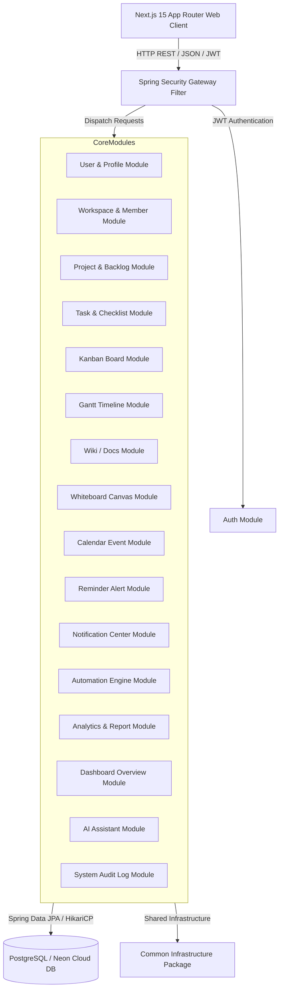
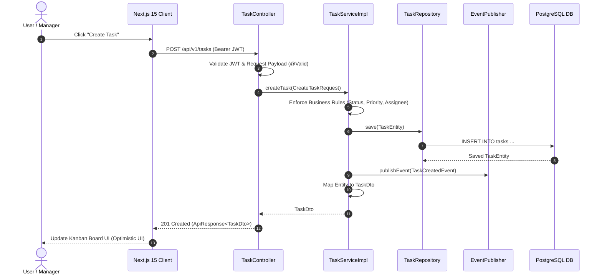

# TaskFlow Architectural Design Document (`architecture.md`)

Tài liệu này trình bày chi tiết kiến trúc tổng thể, mô hình phân rã Domain-Driven Design (DDD) Feature-First, ranh giới các module, quy tắc giao tiếp inter-module, sơ đồ luồng dữ liệu và định hướng mở rộng của hệ thống **TaskFlow**.

---

## 1. Architectural Vision & Core Choices (Tầm Nhìn Kiến Trúc)

### 1.1 Why Domain-Driven Design (DDD)?
Domain-Driven Design đảm bảo cấu trúc kỹ thuật của TaskFlow phản ánh đúng nghiệp vụ cốt lõi. Mỗi vùng nghiệp vụ (Auth, Workspace, Project, Task, Wiki, Whiteboard, Calendar, Reminder, Notification, Automation, AI) được đóng gói thành một **Bounded Context** độc lập. Điều này ngăn chặn việc rò rỉ logic nghiệp vụ giữa các khối, giảm nợ kỹ thuật (technical debt) và giúp từng module dễ dàng tiến hóa độc lập.

### 1.2 Why Feature-First Monorepo?
Kiến trúc Layer-First truyền thống (chia thư mục theo dạng `controllers/`, `services/`, `repositories/` ở gốc) gây ra độ phụ thuộc chéo (coupling) rất cao và khó điều hướng. Cấu trúc **Feature-First** gom tất cả các thành phần liên quan (Entities, Repositories, Services, Controllers, Components, Hooks) vào cùng một thư mục tính năng, tối đa hóa tính đóng gói (cohesion). 

Sử dụng Monorepo (`code/frontend`, `code/backend`, `docs/`, `scripts/`) giúp duy trì "Single Source of Truth" duy nhất cho toàn bộ hệ thống, đồng bộ hóa mã nguồn atomic commits giữa Client và Server.

---

## 2. System High-Level Architecture (Kiến Trúc Tổng Thể)



---

## 3. Package & Domain Boundaries (Ranh Giới Thư Mục & Module)

### 3.1 Common Package (`com.taskflow.common`)
Chứa hạ tầng kỹ thuật dùng chung cho toàn bộ backend:
- `BaseEntity`: Lớp thực thể cha tiêu chuẩn hỗ trợ tự động ghi nhận vết kiểm toán (`id`, `createdAt`, `updatedAt`, `createdBy`, `updatedBy`).
- `ApiResponse<T>`: Vỏ bọc chuẩn hóa cho tất cả phản hồi REST API.
- `GlobalExceptionHandler`: Xử lý ngoại lệ tập trung (`@RestControllerAdvice`).
- `SecurityUtils`: Tiện ích trích xuất thông tin người dùng đang đăng nhập từ Security Context.

### 3.2 List of 22 Domain Bounded Context Modules (`com.taskflow.modules.*`)
Mỗi module vận hành như một gói tự chủ với cấu trúc chuẩn hóa nội bộ:

```
com.taskflow.modules/
├── activity/          # System Audit Trail & User Activity Logs
├── ai/                # AI Agent Prompt Execution & History
├── analytics/         # Deep Performance Metrics & Productivity Charts
├── attachment/        # File Asset Metadata & Upload Storage
├── auth/              # JWT Token Generation, Refresh & Blacklist
├── automation/        # Trigger-Action Automation Rules & Log Executions
├── board/             # Custom Kanban Boards & Dynamic Columns
├── calendar/          # Temporal Calendar Events & Synchronizations
├── checklist/         # Subtask Item Checklists & Progress
├── comment/           # Task Discussion Threads & Mentions
├── dashboard/         # Role-based Summary Dashboard Aggregations
├── notification/      # Real-time In-App & Multi-Channel Alerts
├── project/           # Project Containers & Backlog Management
├── realtime/          # WebSocket Realtime Data Event Dispatching
├── reminder/          # Scheduled Time Reminders & Triggers
├── search/            # Saved Search Filters & Indexing
├── tag/               # Multi-domain Tagging Taxonomy
├── task/              # Core Task Lifecycle, Priorities & Dependencies
├── user/              # User Account Identity & RBAC Roles/Permissions
├── whiteboard/        # Canvas Diagram Elements & Coordinates
├── wiki/              # Knowledge Base Articles & Revision Control
└── workspace/         # Multi-tenant Workspace Boundaries & Invitations
```

Cấu trúc thư mục chuẩn bên trong từng module:
```
com.taskflow.modules.<module-name>/
├── controller/        # REST Controllers (@RestController)
├── service/           # Business Service Interfaces
│   └── impl/          # Concrete Service Implementations
├── repository/        # Spring Data JPA Repositories
├── entity/            # JPA Entities (@Entity)
├── dto/               # Request & Response DTOs
├── mapper/            # Entity <-> DTO Mappers (MapStruct / Manual Mappers)
├── validator/         # Business Rule Validation Logic
└── specification/     # Dynamic Search JPA Specifications
```

---

## 4. Inter-Module Dependency Rules (Quy Tắc Giao Tiếp Module)

### 4.1 Quy tắc độc lập Repository (Service Isolation)
- **Quy tắc 1**: Một module KHÔNG ĐƯỢC PHÉP tiêm (inject) hoặc truy vấn trực tiếp `Repository` của một module khác.
- **Quy tắc 2 (Giao tiếp qua Service)**: Giao tiếp trực tiếp giữa hai module BẮT BUỘC phải thông qua interface `Service` công khai của module đích.
- **Quy tắc 3 (Truyền DTO)**: Dữ liệu trao đổi giữa các module phải được đóng gói trong DTO hoặc kiểu dữ liệu nguyên thủy, tuyệt đối không truyền raw JPA Entity.

```
✅ Cho phép: WorkspaceServiceImpl -> TaskService (Interface)
❌ Cấm: WorkspaceServiceImpl -> TaskRepository
❌ Cấm: TaskController -> WorkspaceRepository
```

### 4.2 Giao tiếp bất đồng bộ qua Sự kiện (Event-Driven Architecture)
Để giảm bớt sự phụ thuộc trực tiếp (loose coupling), các tác vụ phụ (như gửi thông báo khi công việc được giao) sử dụng cơ chế `ApplicationEventPublisher` của Spring Framework:

```java
// Trong TaskServiceImpl: Phát sự kiện
eventPublisher.publishEvent(new TaskAssignedEvent(taskId, assigneeId, assignedBy));

// Trong NotificationServiceImpl: Lắng nghe sự kiện
@EventListener
public void handleTaskAssigned(TaskAssignedEvent event) {
    notificationService.sendNotification(...);
}
```

---

## 5. Sequence Diagram: Task Creation & Execution Flow



---

## 6. Scalability & Microservice Readiness (Định Hướng Mở Rộng Microservices)

Nhờ kiến trúc DDD Feature-First với sự đóng gói nghiêm ngặt:
1. **Low Coupling**: Do các module chỉ giao tiếp qua Service Interfaces hoặc Events, bất kỳ module nào (như `wiki`, `notification`, `ai`) cũng có thể tách thành một Spring Boot Microservice độc lập.
2. **Database Isolation**: Các bảng CSDL được phân vùng rõ ràng theo Bounded Context, giúp việc tách Database per Service trong tương lai diễn ra thuận lợi.
3. **Stateless Scale**: Backend hoàn toàn Stateless nhờ xác thực JWT, cho phép mở rộng chiều ngang (Horizontal Scaling) phía sau Load Balancer (NGINX / AWS ALB).
